# Learning Portal - System Diagrams

This document contains visual representations of the system architecture using Mermaid diagrams.

---

## 1. High-Level System Architecture

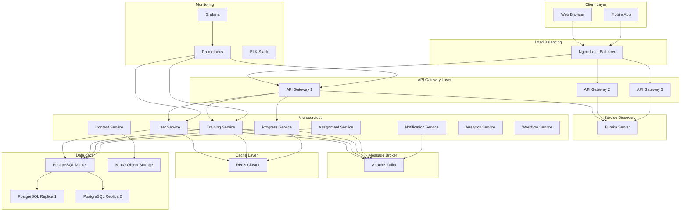

---

## 2. Microservices Communication Flow

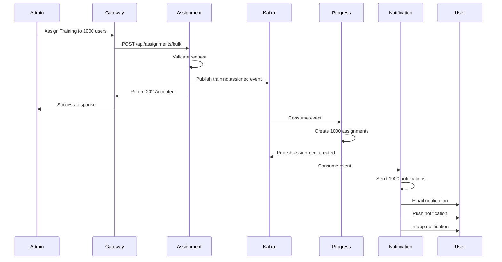

---

## 3. Authentication Flow

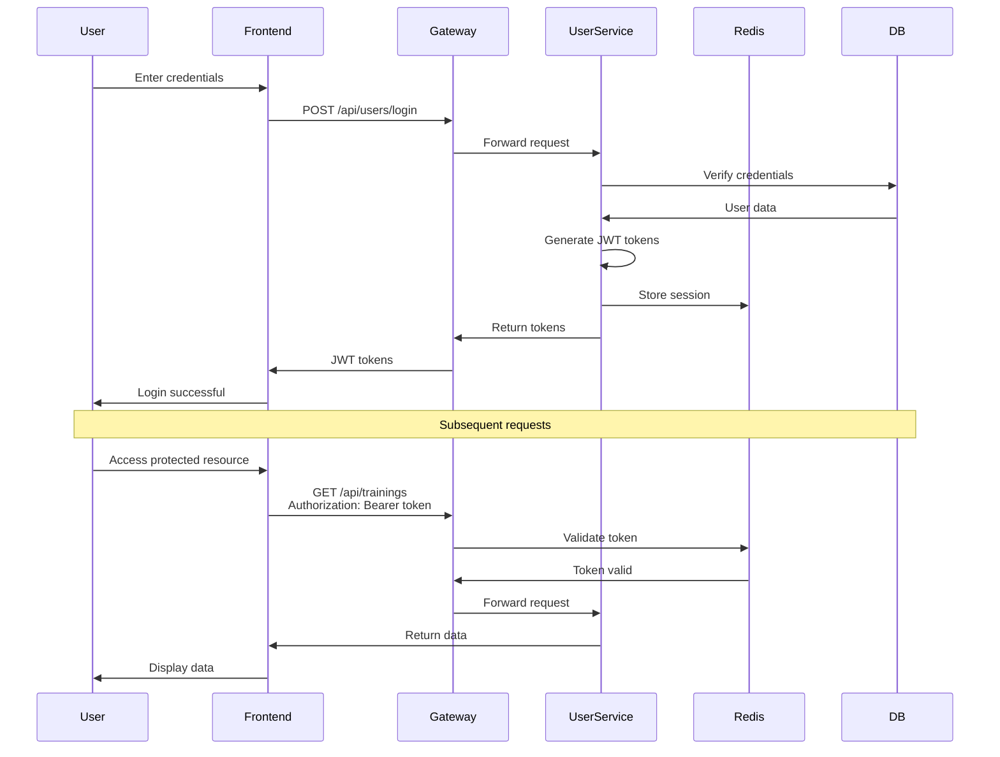

---

## 4. SSO Authentication Flow

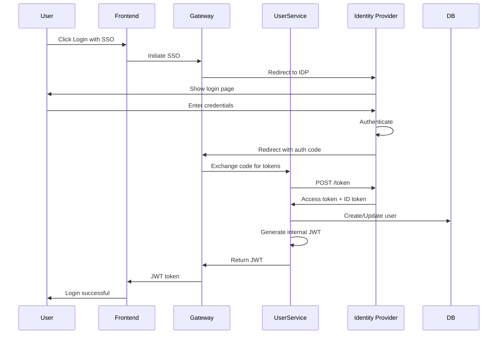

---

## 5. Training Assignment Event Flow

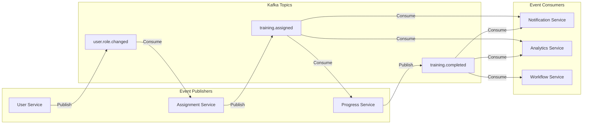

---

## 6. Progress Tracking Flow

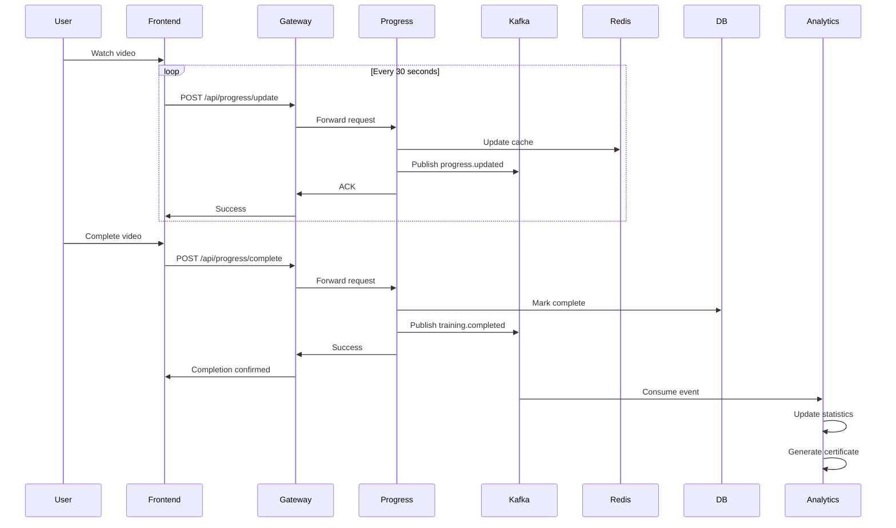

---

## 7. Caching Strategy

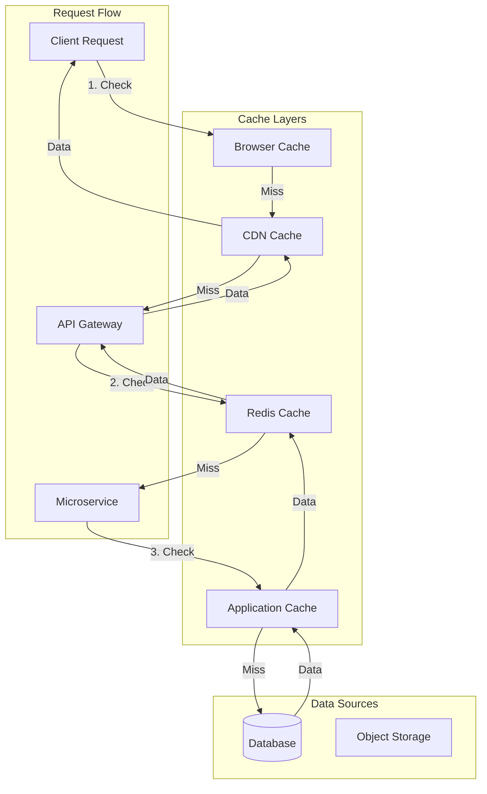

---

## 8. Database Architecture

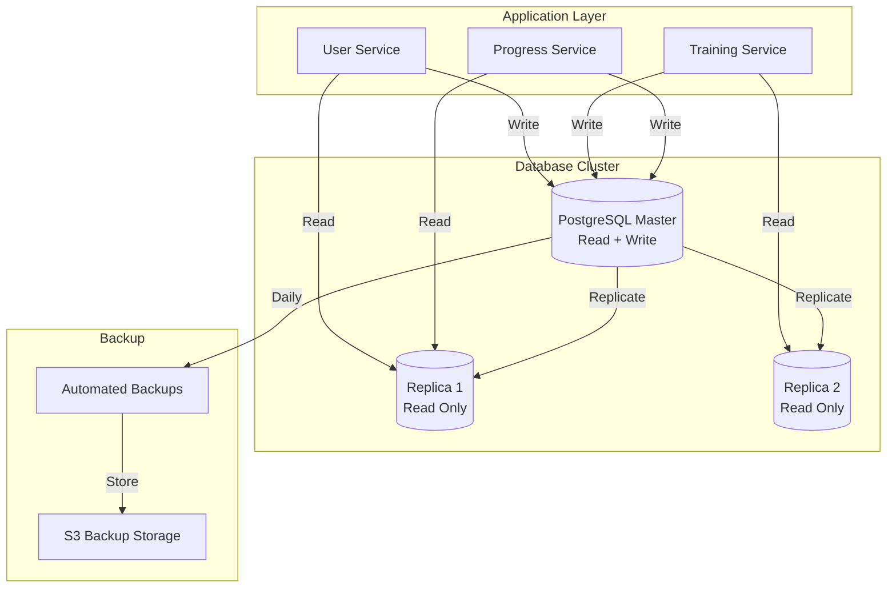

---

## 9. Content Delivery Architecture

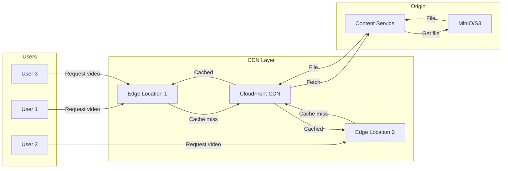

---

## 10. Monitoring Architecture

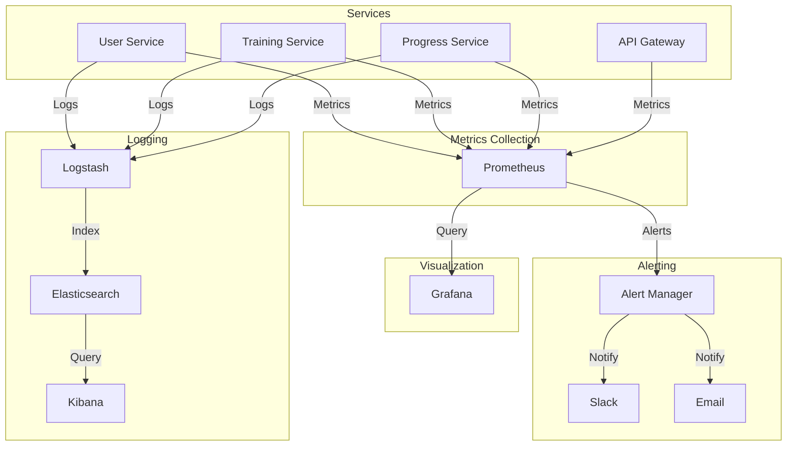

---

## 11. Deployment Architecture

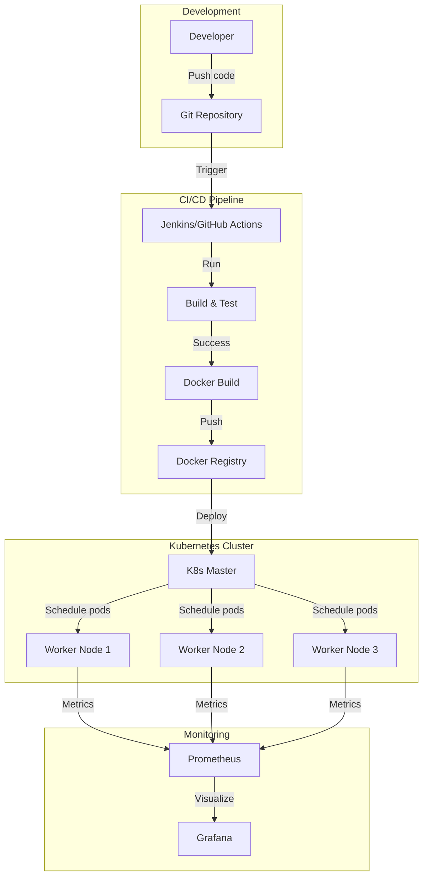

---

## 12. Kafka Topic Architecture

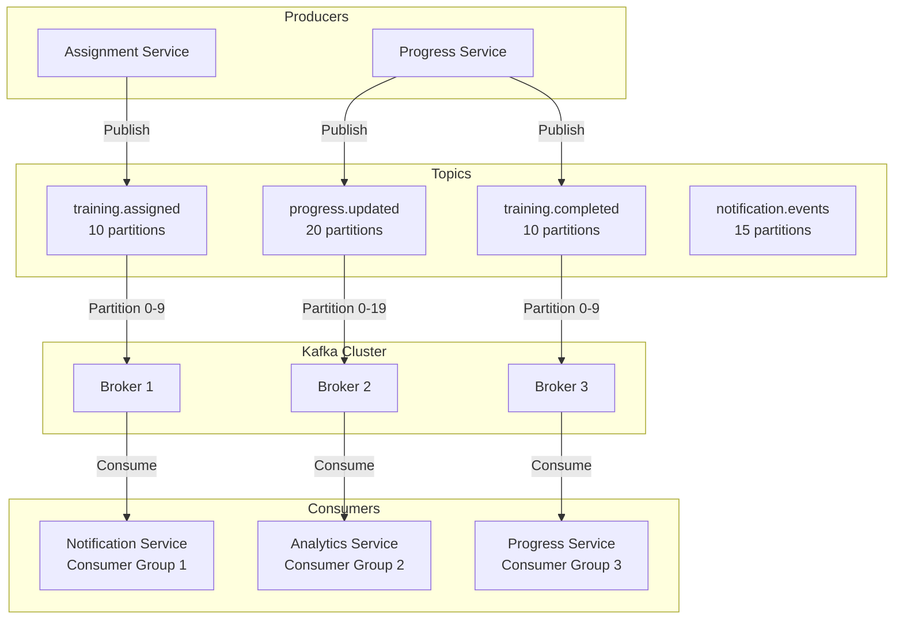

---

## 13. Redis Cluster Architecture

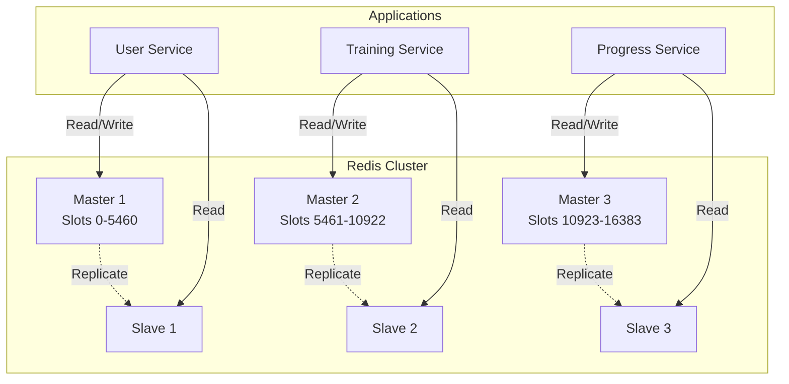

---

## 14. Report Generation Flow

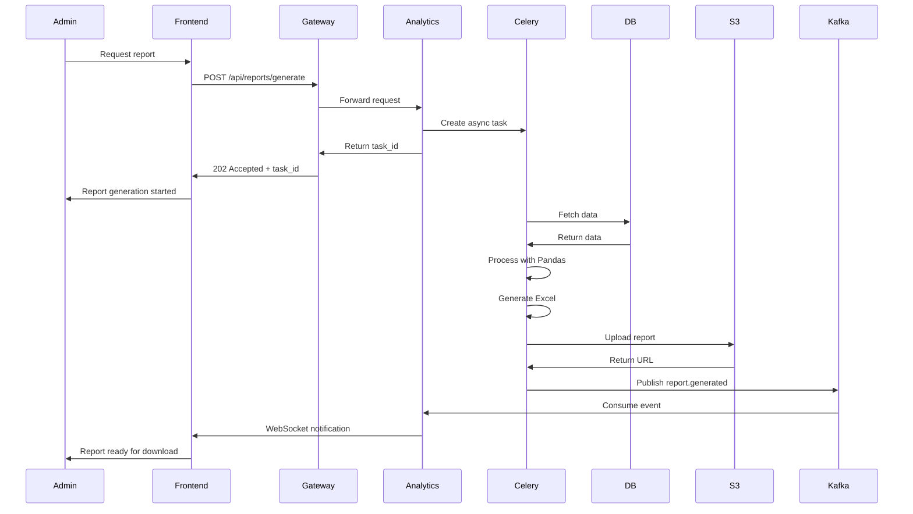

---

## 15. Scaling Strategy

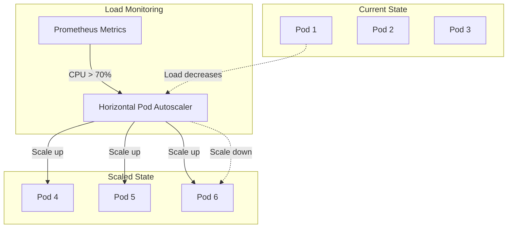

---

## 16. Circuit Breaker Pattern

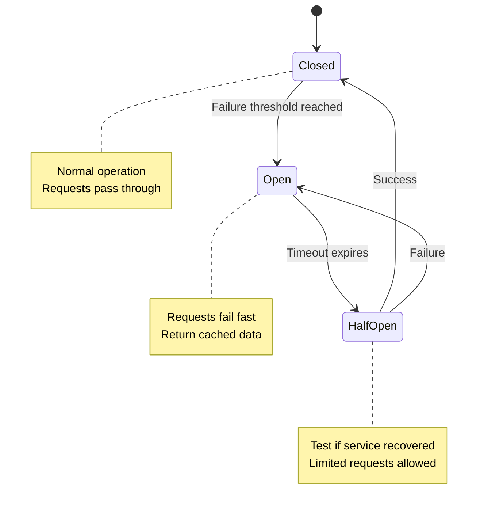

---

## 17. Data Consistency Pattern

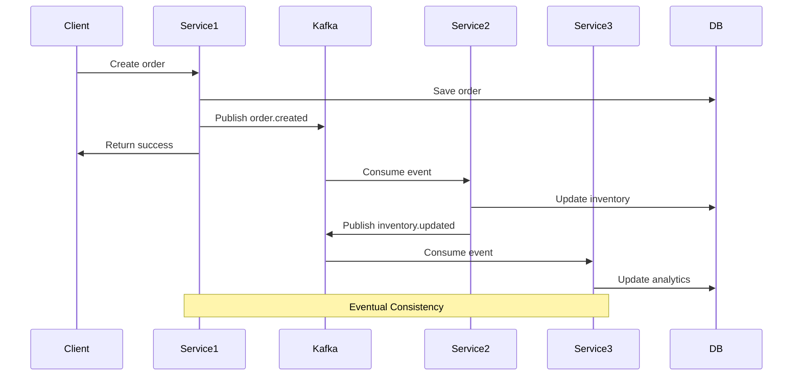

---

## 18. Security Layers

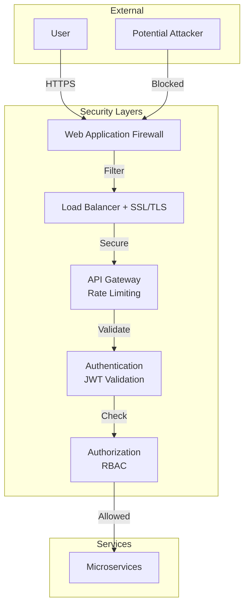

This comprehensive set of diagrams provides visual representations of all major architectural components and flows in the Learning & Development Portal system.
